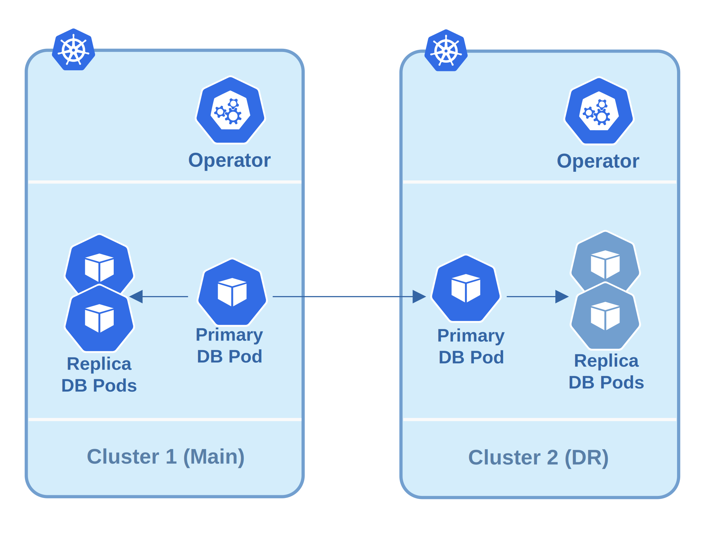

# Standby cluster deployment based on streaming replication

The pgBackRest repo-based standby is the simplest one. The following is the architecture diagram:



## pgBackrest repo based standby

1. This solution describes two Kubernetes clusters in different regions, clouds, data centers or even two namespaces, or running in hybrid mode (on-premises and cloud). One cluster is Main site, and the other is Disaster Recovery site (DR)

2. Each site supposedly includes Percona Operator and for sure includes PostgreSQL cluster.

3. In the DR site the cluster is in Standby mode

4. We set up streaming replication between these two clusters

## Deploy disaster recovery for PostgreSQL on Kubernetes

### Configure Main site

1. Deploy the Operator [using your favorite method](System-Requirements.md#installation-guidelines).

2. The Main cluster needs to expose it, so that standby can connect to the primary PostgreSQL instance. To expose the primary PostgreSQL instance, use the `spec.expose` section:

    ```yaml
    spec:
      ...
      expose:
        type: ClusterIP
    ```

    Use here a Service type of your choice. For example, `ClusterIP` is sufficient for two clusters in different namespaces.

3. Once configured, apply the custom resource:

    ```{.bash data-prompt="$"}
    $ kubectl apply -f deploy/cr.yaml -n main-pg
    ```

    ??? example "Expected output"

        ```{.bash .no-copy}
        perconapgcluster.pg.percona.com/standby created
        ```

    The service that you should use for connecting to standby is called <clustername>-ha (main-ha in my case):

    ```text
    main-ha          ClusterIP   10.118.227.214   <none>        5432/TCP   163m
    ```

### Configure DR site

To get the replication working, the Standby cluster would need to authenticate with the Main one. To get there, both clusters must have certificates signed by the same certificate authority (CA). Default replication user `_crunchyrepl` will be used.

In the simplest case you can copy the certificates from the Main cluster. You need to look out for two files:
* main-cluster-cert
* main-replication-cert 

Copy them to the namespace where DR cluster is going to be running and reference under `spec.secrets` (in the following example they were renamed, replacing "main" with "dr"):

```yaml
spec:
  secrets:
    customTLSSecret:
      name: dr-cluster-cert
    customReplicationTLSSecret:
      name: dr-replication-cert
```

If you are generating your own certificates, just remember the following rules:

1. Certificates for both Main and Standby clusters must be signed by the same CA
2. `customReplicationTLSSecret` must have a Common Name (CN) setting that matches `_crunchyrepl`, which is a default replication user.

You can find more about certificates in the [TLS doc](TLS.md).

Apart from setting certificates correctly, you should also set standby configuration.

```yaml
  standby:
    enabled: true
    host: main-ha.main-pg.svc
```

* `standby.enabled` controls if it is a standby cluster or not
* `standby.host` must point to the primary node of a Main cluster. In this example it is a `main-ha` Service in another namespace.

Deploy the standby cluster by applying the manifest:

```{.bash data-prompt="$"}
$ kubectl apply -f dr-cr.yaml -n dr-pg
```

??? example "Expected output"

    ```{.bash .no-copy}
    perconapgcluster.pg.percona.com/standby created
    ```

Once both clusters are up, you can verify that replication is working.

1. Insert some data into Main cluster
2. Connect to the DR cluster

To connect to the DR cluster, use the credentials that you used to connect to Main. This also verifies that the connection is working. You should see whatever data you have in the Main cluster in the Disaster Recovery.


## Failover

In case of the Main site failure or in other cases, you can promote the standby cluster. The promotion effectively allows writing to the cluster. This creates a net effect of pushing Write Ahead Logs (WALs) to the pgBackrest repository. It might create a split-brain situation where two primary instances attempt to write to the same repository. To avoid this, make sure the primary cluster is either deleted or shut down before trying to promote the standby cluster.

Once the primary is down or inactive, promote the standby through changing the corresponding section:

```yaml
spec:
  standby:
    enabled: false
```

Now you can start writing to the cluster.

### Split brain

There might be a case, where your old primary comes up and starts writing to the repository. To recover from this situation, do the following:

1. Keep only one primary with the latest data running
2. Stop the writes on the other one
3. Take the new full backup from the primary and upload it to the repo

### Automate the failover

Automated failover consists of multiple steps and is outside of the Operator’s scope. There are a few steps that you can take to reduce the Recovery Time Objective (RTO). To detect the failover we recommend having the 3rd site to monitor both DR and Main sites. In this case you can be sure that Main really failed and it is not a network split situation.

Another aspect of automation is to switch the traffic for the application from Main to Standby after promotion. It can be done through various Kubernetes configurations and heavily depends on how your networking and application are designed. The following options are quite common:

1. Global Load Balancer - various clouds and vendors provide their solutions
2. Multi Cluster Services or MCS - available on most of the public clouds
3. Federation or other multi-cluster solutions

## Streaming replication


