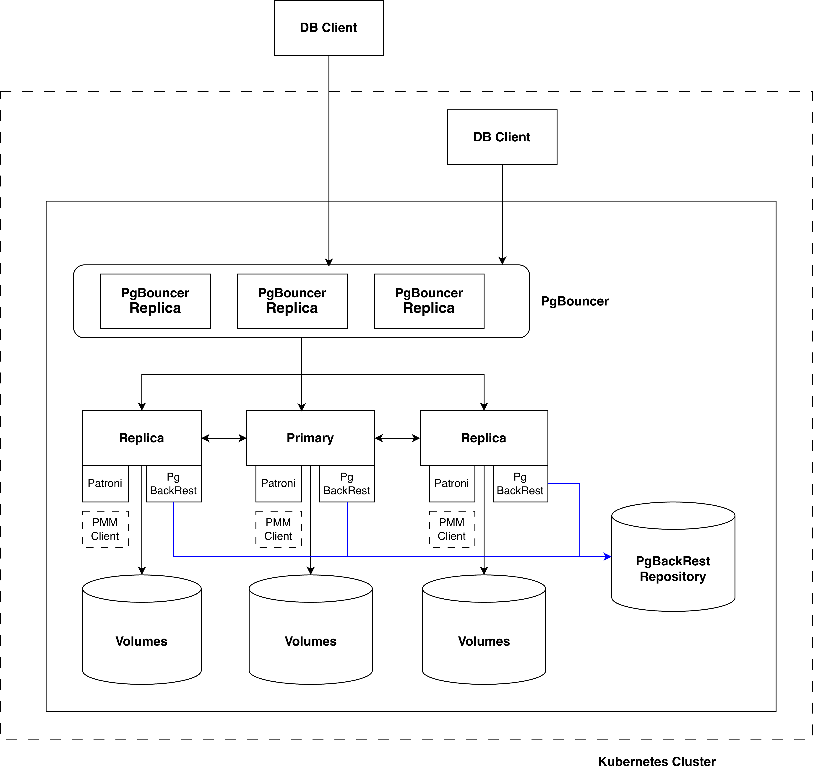

# Architecture of Percona PostgreSQL Operator

This document provides a high-level overview of the Percona PostgreSQL Operator architecture, explaining how the various components connect to create a production-ready PostgreSQL cluster on Kubernetes.

As explained in section 1.1 ( TO-DO: Link from 1.1 Anastasia), Operator manages application in this case a Percona Postgres Cluster.

## High-Level Architecture Overview

Following diagram describes important components involved

1. **pgBouncer**
 PgBouncer is a lightweight connection pooler for PostgreSQL that sits between client applications and the database server to manage and reuse connections efficiently. Instead of each client opening its own database connection, PgBouncer maintains a pool of connections and serves them to clients on demand, significantly reducing connection overhead and improving performance, especially for applications with many short-lived or concurrent connections.

2. **Percona PostgreSQL cluster** 
Percona Distribution for PostgreSQL provides the best and most critical enterprise components from the open source community, in a single distribution, designed and tested to work together. Patroni, pgBackRest, pg_repack, and pgaudit are among the innovative components we utilize.

3. **Patroni**
Patroni is an open-source high-availability solution for PostgreSQL that automates replication management and failover. It uses a distributed configuration store (such as etcd, Consul, or ZooKeeper) to maintain cluster state and coordinate leader election, ensuring that a healthy primary is always available. Patroni simplifies building and operating resilient PostgreSQL clusters by handling node monitoring, failover, and recovery automatically.

4. **pgBackRest**
pgBackRest is an open-source backup and restore solution for PostgreSQL designed for reliability, performance, and scalability. It supports full, differential, and incremental backups, compression and encryption, parallel processing, and point-in-time recovery, making it suitable for both small and large PostgreSQL environments. pgBackRest helps ensure data safety by providing efficient, consistent backups and fast restores for production PostgreSQL systems.

5. **PMM Client**( Optional)
PMM Client is a lightweight agent installed on database hosts to collect metrics, logs, and performance data and send them to Percona Monitoring and Management (PMM) Server. It gathers detailed insights from databases and the operating system—such as query performance, resource usage, and health metrics—enabling centralized monitoring, troubleshooting, and performance optimization for PosgreSQL Cluster

This architecture provides high availability, automatic failover, connection pooling, backup and recovery, and comprehensive monitoring—all managed declaratively through Kubernetes Custom Resources.

Detailed components and the kubernetes resources used in the operator environment can be found at the section( Refer Different_components_involved)