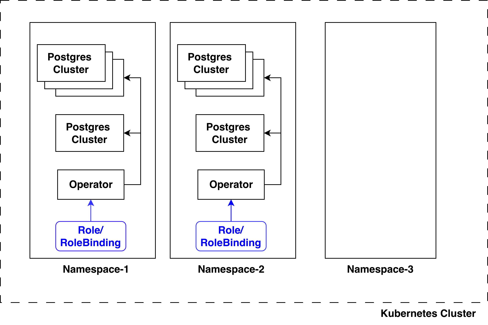
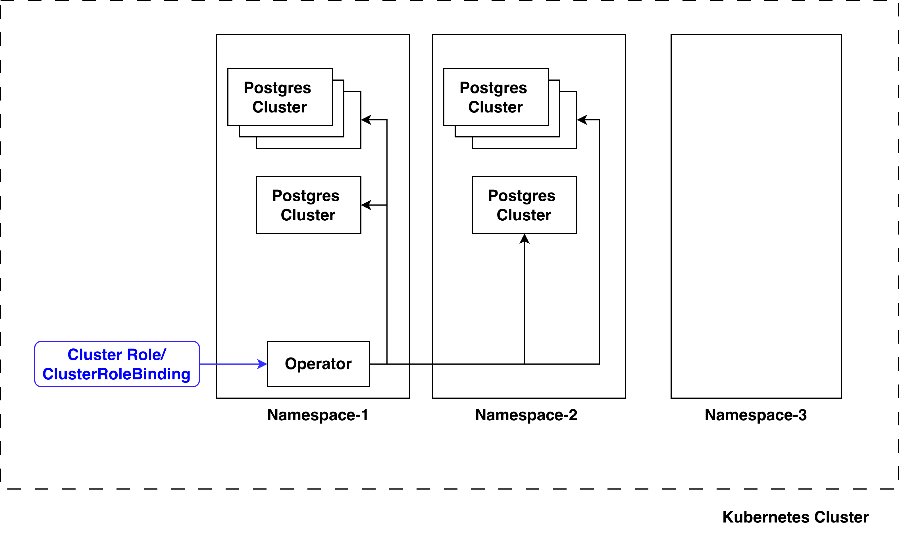

# Percona Operator for PostgreSQL Single-namespace and Multi-namespace deployment Modes

The Percona Operator for PostgreSQL supports two distinct deployment patterns that determine how the operator manages PostgreSQL clusters across Kubernetes namespaces:

* **Namespace-scoped deployment** - An operator running in a namespace can manage PostgreSQL clusters only within that namespace(Recommended).
* **Cluster-wide deployment** - The operator can manage PostgreSQL clusters across all or selected namespaces in the Kubernetes cluster.

This document provides details on both deployment modes, their underlying Kubernetes mechanisms, configuration requirements, and operational considerations.

## Overview

Main difference between namespace mode/cluster wide mode are following:
1. **RBAC associated with the Operator Deployment** 
Namespaced mode uses Role,RoleBindings with the service account 
Cluster Wide Mode uses ClusterRole,ClusterRoleBindings with the service account
2. **WATCH_NAMESPACE environment variable** 
For namespace-scoped mode, this value is set to the name of the namespace in which the operator is installed.
For cluster-wide mode, the value can be an empty string (`""`) to manage all namespaces, or a comma-separated list of namespaces to manage a selected subset(Example `WATCH_NAMESPACE=namespace1,namespace2`).

## Namespace-Scoped Deployment

In namespace-scoped mode, each operator instance is confined to a single Kubernetes namespace. The operator uses Kubernetes `Role` and `RoleBinding` resources, which are namespace-scoped, limiting its permissions and watch scope to that specific namespace. **This is the default and recommended deployment pattern**.

**Key Characteristics:**
- Uses `Role` and `RoleBinding` (namespace-scoped RBAC) . https://github.com/percona/percona-postgresql-operator/blob/v2.8.2/deploy/rbac.yaml ( Link to actual repo ../deploy/rbac.yaml)
- Operator watches only the namespace where it's deployed
- Multiple operator instances can coexist in different namespaces
- Provides strong isolation and security boundaries
- Minimal blast radius in case of operator issues

### Cluster-Wide Deployment

In cluster-wide mode, a single operator instance can manage PostgreSQL clusters across multiple specified namespaces. The operator uses Kubernetes `ClusterRole` and `ClusterRoleBinding` resources, which are cluster-scoped, allowing it to access resources across namespaces.

**Key Characteristics:**
- Uses `ClusterRole` and `ClusterRoleBinding` (cluster-scoped RBAC) https://github.com/percona/percona-postgresql-operator/blob/v2.8.2/deploy/cw-rbac.yaml ( Link to actual repo ../deploy/cw-rbac.yaml)
- Operator watches multiple namespaces specified in `WATCH_NAMESPACE`
- Requires cluster-admin privileges for RBAC setup
- Wider blast radius in case of operator failures

### Installation/Configuration

Refer to the installation instructions using
- [kubectl](./2.1.2_kubectl_installation.md)
- [helm](./2.1.3_helm_installation.md) 
- [Operator hub](./2.1.4_operator_hub_installation.md)

**Important Notes:**
- Cluster names can be identical across namespaces (e.g., `cluster1` in both `percona-db-1` and `percona-db-2`)
- CRDs are cluster-scoped and shared. Installing once is sufficient. Similarly ensure that CRD are not deleted when there is an instance of Operator or a Database Cluster running.
- `PGO_NAMESPACE` is an environment variable used in the operator. This variable indicates the namespace where the operator is installed. This is used for managing related objects like secrets for the proper working of an operator.
- The `WATCH_NAMESPACE` environment variable must contain the namespace in which the operator is deployed, unless the value is an empty string (`""`). For example, if the operator is deployed in the `pg-operator` namespace and needs to manage PostgreSQL clusters in other namespaces, `WATCH_NAMESPACE` must include `pg-operator` in the comma-separated list. For example:`WATCH_NAMESPACE=pg-operator,namespace1,namespace2`
- Namespace mode is the recommended and default mode. This provides better isolation and has lesser blast radius compared to cluster wide mode.
